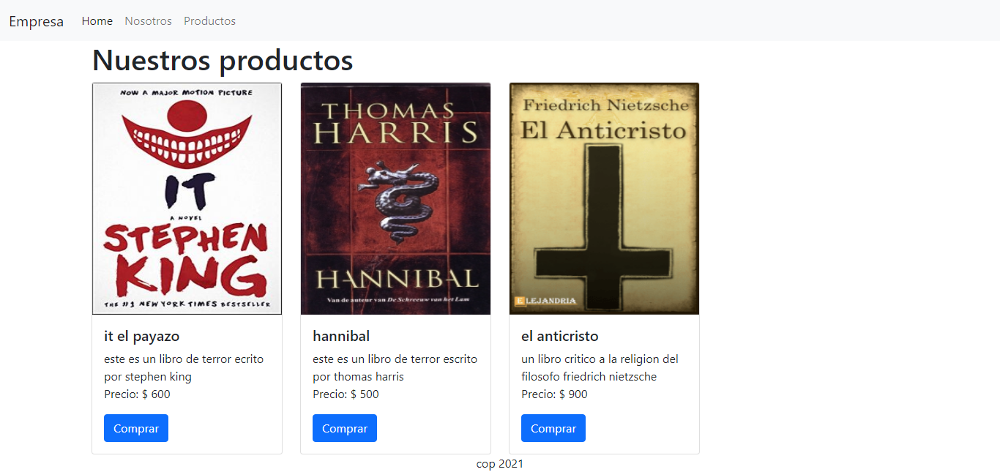

<h1 align="center"> Sitio con nodeJS </h1>


_este sitio se destaca por su construccion en el lado del servidor con NodeJS_

### Comenzando 🚀

_Estas instrucciones te permitirán obtener una copia del proyecto en funcionamiento en tu máquina local para propósitos de desarrollo y pruebas._

Mira **Deployment** para conocer como desplegar el proyecto.


### Pre-requisitos 📋

_instalar estas versiones de preferencia_

```
/@user> node -v
> 16.x.x
```

```
/@user> npm -v
> 8.x.x
```

### Instalación del repo 🔧

_Para poder instalar el repositorio necesitamos tener instalado GIT, usa el siguiente comando para tener el repo de manera local_

```
/@user> git clone https://github.com/Daniel-Santiago-Acosta-1013/sitio_con_nodeJS.git
```

_entramos al directorio de nuestro proyecto y ejecutamos_

```
/@user> npm i 
```

_de esa manera tenemos las dependecias pertinentes_

### Ejecutamos el proyecto ⚙️
```
/@user> npm run dev
```

### Caracteristicas del proyecto ✔

<p align="center">
  
</p>

### Construido con 🛠️

_herramientas utilizadas en el proyecto_

* [NodeJS](https://nodejs.org/es/) - framework 
* [debug](https://www.npmjs.com/package/debug) - libreria
* [cookie-parser](https://www.npmjs.com/package/cookie-parser) - libreria
* [ejs](https://www.npmjs.com/package/ejs) - libreria
* [express](https://www.npmjs.com/package/express) - libreria
* [http-errors](https://www.npmjs.com/package/http-errors) - libreria
* [morgan](https://www.npmjs.com/package/morgan) - libreria
* [mysql](https://www.npmjs.com/package/mysql) - libreria  
* [nodemon](https://www.npmjs.com/package/nodemon) - libreria


## Autores ✒️

* **Daniel Santiago Acosta** - *Trabajo Inicial* - [Daniel Santiago Acosta](https://github.com/Daniel-Santiago-Acosta-1013)

